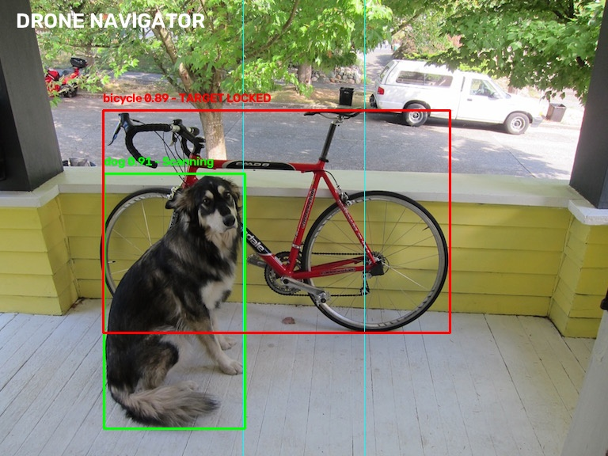

# Drone Navigator's Telemetry System

## Vision-Based Object Detection and Target Lock for Search-and-Rescue Drones

A real-time computer vision system that uses **YOLOv8** and **OpenCV** to detect objects from a drone-camera perspective and identify a target within the central field of view.

The system is designed around a search-and-rescue scenario where a drone scans its surroundings and automatically places a **Target Lock** on a relevant detected object when it enters the central target zone.

---

## Project Overview

In search-and-rescue operations, drones can assist in locating people and vehicles from an aerial or camera-based view.

This project implements the computer vision component of such a system.

The application:

- Captures live video from a camera.
- Detects objects using YOLOv8.
- Filters detections using a confidence threshold.
- Identifies relevant target classes.
- Defines the middle 20% of the camera frame as the target zone.
- Selects the target closest to the center of the frame.
- Displays `TARGET LOCKED` when a valid target enters the target zone.
- Displays `Scanning` for other detected targets.
- Estimates simulated distance using bounding-box height.
- Displays real-time FPS.
- Provides a simple Drone HUD interface.

---

## Features

### 1. Real-Time Object Detection

The system uses the **YOLOv8 Nano (`yolov8n.pt`)** pretrained model for real-time object detection.

The Nano model is selected because it is lightweight and suitable for applications where computational resources are limited.

### 2. Confidence Filtering

Only detections with confidence greater than or equal to **0.60** are considered.

This helps reduce low-confidence detections.

### 3. Target Class Filtering

The system currently considers the following objects as valid targets:

```text
person
bicycle
car
motorcycle
bus
truck

Other objects detected by YOLO are ignored by the target-selection system.

### 4. Target Lock Zone

The middle 20% of the camera frame is defined as the Target Lock Zone.

|----------|================|----------|
           Target Zone
              20%

If a valid target enters this region, it becomes eligible for target locking.

### 5. Automatic Target Selection

If multiple valid targets are present inside the target zone, the system selects the object whose center is closest to the center of the camera frame.

The selected object is displayed as: RED → TARGET LOCKED

Other valid detections are displayed as: GREEN → Scanning

### 6. Simulated Distance Estimation

The system estimates object distance using the relationship between the object's known approximate height, camera focal length, and detected bounding-box height.

The simplified formula is:

Distance = (Known Object Height × Focal Length)
           / Bounding Box Height

This is a simulated distance estimate and is not intended to represent a calibrated real-world distance measurement.

### 7. FPS Monitoring

The application calculates and displays the approximate real-time processing speed:

FPS: XX.X

This helps evaluate the performance of the computer vision pipeline.

### 8. Drone HUD

The application displays a simple heads-up display containing:

Project title
FPS
Target Zone
Object bounding boxes
Object confidence
Target status
Simulated distance
Technologies Used
Technology	Purpose
Python	Application development
YOLOv8	Object detection
Ultralytics	YOLO model implementation
OpenCV	Camera input, image processing and HUD
NumPy	Numerical operations through project dependencies

### Project Structure

Drone-Navigator-Telemetry-System/
│
├── assets/
│   └── test.jpg
│
├── outputs/
│   └── detection_result.jpg
│
├── src/
│   └── main.py
│
├── .gitignore
├── LICENSE
├── README.md
└── requirements.txt

The YOLO model file (yolov8n.pt) is excluded from version control using .gitignore.

### Installation

1. Clone the repository
git clone <YOUR_GITHUB_REPOSITORY_URL>

Move into the project directory:

cd Drone-Navigator-Telemetry-System

2. Create a virtual environment
python -m venv .venv

3. Activate the virtual environment
Windows PowerShell
.venv\Scripts\Activate.ps1
Windows Command Prompt
.venv\Scripts\activate

4. Install dependencies
python -m pip install -r requirements.txt
Running the Application

Run:

python src/main.py

The application will:

Load the YOLOv8 model.
Open the webcam.
Start real-time object detection.
Display detected target classes.
Identify objects inside the target zone.
Lock onto the target closest to the frame center.
Display simulated distance and FPS.

Press: q
to exit the application.

### Target Lock Logic

The target-selection process follows these steps:

Camera Frame
     ↓
YOLOv8 Detection
     ↓
Confidence Filtering
     ↓
Target Class Filtering
     ↓
Calculate Object Center
     ↓
Check Middle 20% Target Zone
     ↓
Find Object Closest to Frame Center
     ↓
TARGET LOCKED


If no valid target is inside the target zone, the system continues scanning.

Distance Estimation

The system uses bounding-box height as an approximate indicator of distance.

When an object becomes closer to the camera:

Bounding Box Height ↑
        ↓
Estimated Distance ↓

When an object moves farther away:

Bounding Box Height ↓
        ↓
Estimated Distance ↑

The current implementation uses fixed parameters for a simulated estimate and would require camera and object calibration for accurate real-world distance measurement.

### Performance

The application uses the YOLOv8 Nano model with a reduced inference image size to improve real-time performance.

Current inference configuration:

model(frame, imgsz=416, verbose=False)

The application also displays FPS so that performance can be monitored during execution.

### Limitations

This project currently focuses on the computer vision component of a drone search-and-rescue system.

Current limitations include:

Webcam is used instead of an actual drone camera.
Distance estimation is simulated.
Target classes are limited to selected pretrained YOLO classes.
The pretrained model may occasionally misclassify objects.
No custom dataset or custom-trained YOLO model is currently used.
No physical drone flight control is implemented.
No GPS or hardware telemetry integration is implemented.
Future Improvements

### Possible future improvements include:

Custom YOLO training for rescue-specific targets.
Improved distance calibration using a real camera.
Integration with an actual drone camera feed.
GPS-based target coordinates.
Obstacle detection and avoidance.
Real drone telemetry integration.
Target tracking across consecutive frames.
GPU acceleration for higher FPS.
Improved HUD and alert system.
Learning Outcomes

### Through this project, the following concepts were implemented:

Python programming
Computer vision
Real-time video processing
Object detection
YOLOv8 inference
Bounding-box processing
Confidence thresholding
Object center calculation
Target selection logic
Distance estimation
FPS calculation
OpenCV visualization
Real-time system development

### Author

Apurva Patle

Electronics / Computer Vision Project

### License

This project is intended for educational and portfolio purposes.

---

## Demo

### Object Detection and Target Lock

The system detects objects in real time and identifies the valid target closest to the center of the camera frame.



In this example:

- The bicycle is detected with high confidence.
- The bicycle enters the central target zone.
- The system marks it as `TARGET LOCKED`.
- Other detected objects remain in `Scanning` mode.